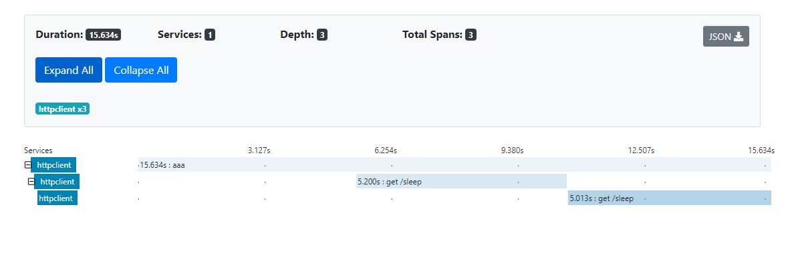
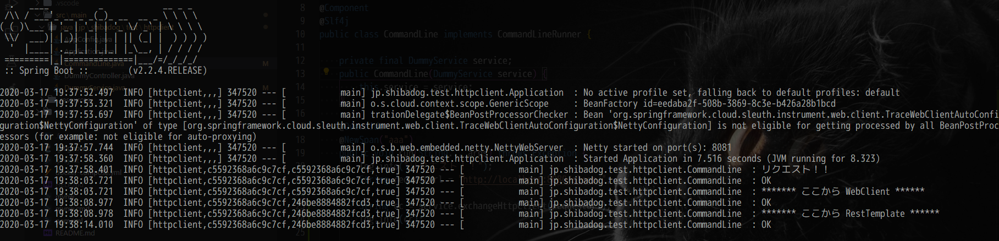
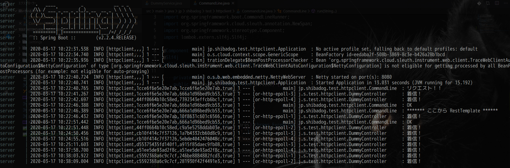

# いろいろけんしょうしたやつ

## 検証起動方法

``` powershell
PS> ./mvnw clean package
PS> docker-compose up -d
PS> java -D"spring.zipkin.base-url=http://localhost:9411" -D"server.port=8081" -jar .\target\httpclient-with-boot-0.0.1-SNAPSHOT.jar
```






